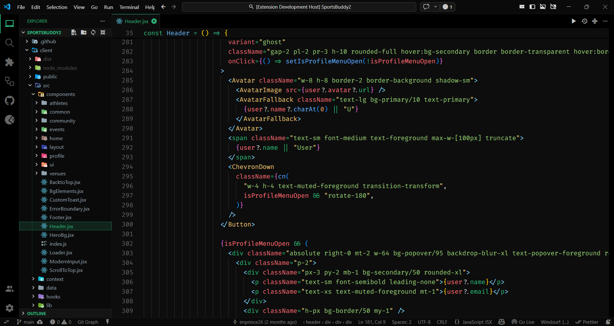
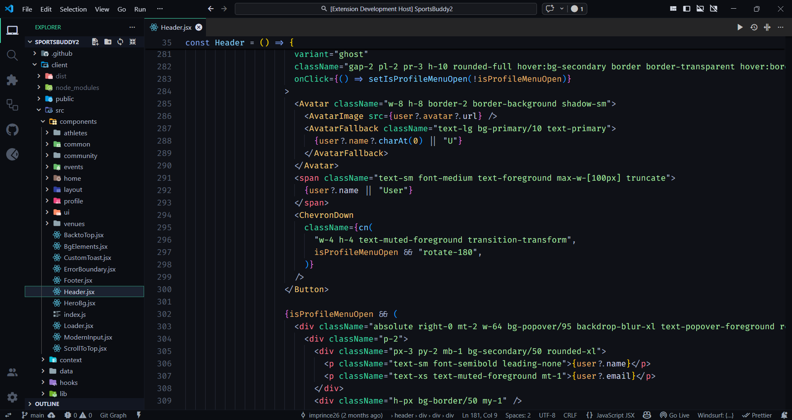
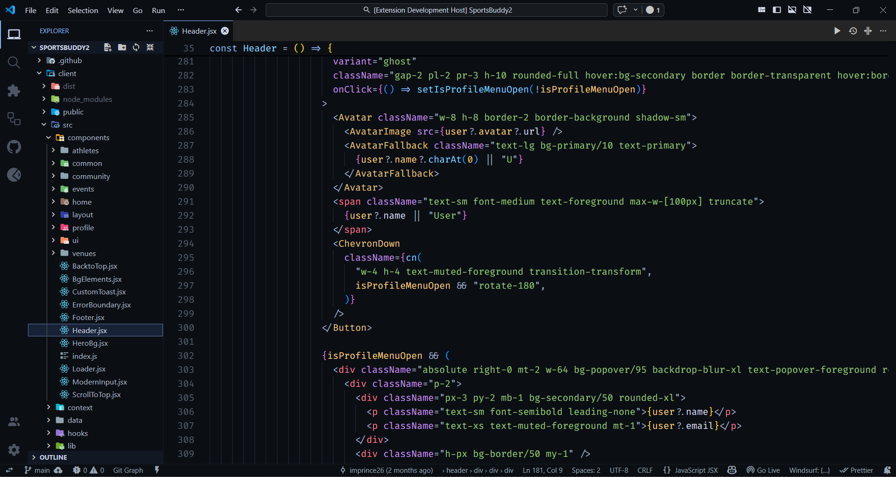

# PR-Theme

PR-Theme is a premium dark theme pack for Visual Studio Code, built for long coding sessions. It delivers crisp contrast, refined accents, and carefully tuned syntax colors across languages and UI surfaces.

## What Makes It Different

PR-Theme prioritizes readability without sacrificing personality. Deep backgrounds reduce glare, while restrained accents provide clear focus on selections, cursors, and active UI. Every token color is chosen to separate meaning at a glance, improving scanning, navigation, and comprehension.

## Theme Variants

- **PR-Theme Classic**: Signature green accents on deep black for a sharp, modern look
- **PR-Theme Premium**: Softer contrast and elegant highlights for extended focus
- **PR-Theme Obsidian**: Blue-gray accents for a cooler, subdued visual profile

## Design Principles

- **Long-Session Comfort**: Balanced contrast that reduces eye fatigue without flattening detail
- **High-Definition Syntax**: Distinct colors for keywords, functions, variables, strings, and types
- **UI Consistency**: Cohesive styling for editor, sidebar, terminal, tabs, and notifications
- **Language Coverage**: Optimized for JavaScript, TypeScript, JSON, HTML, CSS, Python, and more

## Preview

| Preview |
| --- |
| **PR-Theme Classic**  |
| **PR-Theme Premium**  |
| **PR-Theme Obsidian**  |

If you want a dark theme that feels premium, remains readable for hours, and makes your code stand out with clarity, PR-Theme is built for you.
